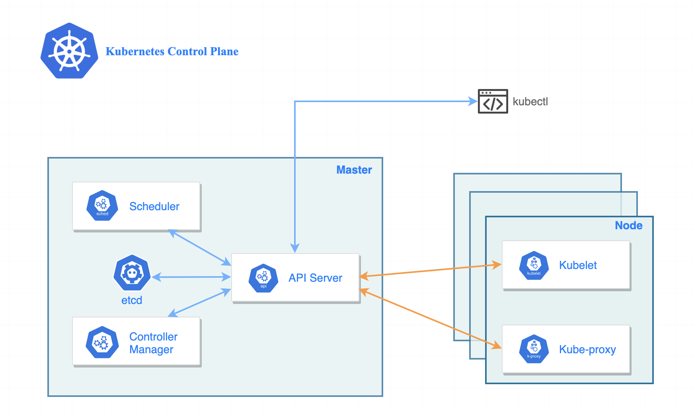

# Controller and Deployment Notes

## Labels

#### Imperative
* add
```sh
kubectl label nodes k8s-worker disk=hdd
```
* overwrite
```sh
kubectl label nodes k8s-worker disk=ssd --overwrite
```
* delete
```sh
kubectl label nodes k8s-worker1 disk-
```

#### Declarative
```yaml
apiVersion: v1
kind: Pod
metadata:
  name: nginx-pod-1
  labels:
    app: v1
    tier: PROD
spec:
  containers:
  - name: nginx
    image: nginx
---
apiVersion: v1
kind: Pod
metadata:
  name: nginx-pod-2
  labels:
    app: v1
    tier: ACC
spec:
  containers:
  - name: nginx
    image: nginx
---
apiVersion: v1
kind: Pod
metadata:
  name: nginx-pod-3
  labels:
    app: v1
    tier: TEST
spec:
  containers:
  - name: nginx
    image: nginx
```

#### Querying
```sh
kubectl get pods --show-labels
kubectl get pods --selector disk=hdd
```

## Deployment

### 相依關係
Deployment 	&rarr; ReplicaSets 	&rarr; pods

#### Imperative
```sh
kubectl create deployment web --image=nginx
```
擴充
```sh
kubectl scale deployment web --replicas 5
```

#### Declarative
```yaml
apiVersion: apps/v1
kind: Deployment
metadata:
  labels:
    app: web
  name: web
spec:
  replicas: 1
  selector:
    matchLabels:
      app: web
  template:
    metadata:
      labels:
        app: web
    spec:
      containers:
      - image: nginx:1.14.2
        name: nginx
```
```sh
kubectl apply -f deploy-web.yaml
```
編輯修改
```sh
kubectl edit deployments.apps web
```
Update image
```sh
kubectl set image delpoyment/web nginx=nginx=1.26.0
```

## Rolling Back
查看history
```sh
kubectl rollout history deployment web
```
回滾編號
```sh
kubectl rollout undo deployment web --to-revision=1
```

## ReplicaSets

| **特性** | **ReplicaSets** | **Deployment** |
|---|---|---|
| **功能** | 維持 Pod 副本數量 | 管理 ReplicaSets，提供滾動更新和回滾等功能 |
| **更新機制** | 無自動更新機制 | 支援滾動更新、自動回滾 |
| **用途** | 確保 Pod 數量穩定，重啟崩潰的 Pod | 管理應用部署和擴展，確保應用平滑更新 |
| **獨立使用** | 可獨立使用，但不常直接管理 | 通常是用來管理 ReplicaSets，作為高層資源 |
| **擴展/縮減副本數量** | 手動調整 | 可以輕鬆進行副本數量的擴展或縮減 |
| **滾動更新** | 不支持滾動更新 | 支援滾動更新，避免更新過程中的服務中斷 |
| **回滾** | 無回滾功能 | 支援回滾到先前的版本 |


## DaemonSet
```yaml
apiVersion: apps/v1
kind: DaemonSet
metadata:
  name: hello-ds
spec:
  selector:
    matchLabels:
      app: hello-world
  template:
    metadata:
      labels:
        app: hello-world
    spec:
      containers:
      - name: hello-world
        image: nginx:1.14
```

#### Deployment vs DaemonSet

| 特性 | Deployment | DaemonSet |
| --- | --- | --- |
| **用途** | 管理普通應用程序的 Pod 副本 | 確保每個節點上都有一個 Pod 副本 |
| **Pod 副本數量** | 根據 `replicas` 設置數量 | 集群中的每個節點都有一個 Pod 副本 |
| **使用情境** | 適合 Web 應用、API 服務等 | 適合日誌收集、監控代理、網絡代理等 |
| **滾動更新** | 支持滾動更新 | 支持滾動更新 |
| **擴展性** | 可以根據需要動態增加或減少 Pod 副本 | 無法動態調整 Pod 數量，Pod 副本數等於節點數量 |
| **容錯性** | 根據 `replicas` 的設置保證高可用性 | 每個節點都有一個 Pod，保證每個節點的服務運行 |
