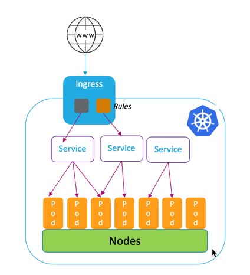
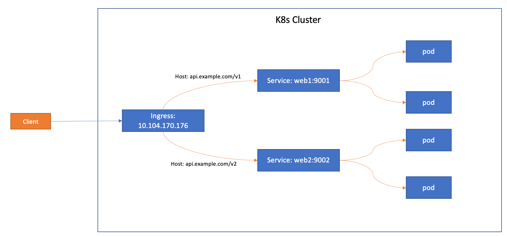

# Networking

## Service

### Service Types

#### ClusterIP

```sh
kubectl expose deployment web --port=80 --target-port=8080
```

```yaml
apiVersion: v1
kind: Service
metadata:
  name: web
spec:
  ports:
  - port: 80
    protocol: TCP
    targetPort: 80
  selector:
    app: web
```

* `用途`：預設類型，將服務暴露給叢集內部的其他`pod`。
* `❌外部訪問`：只能通過叢集內部的`pod`或其他服務來訪問，外部無法訪問。

#### NodePort

```sh
kubectl expose deployment web --target-port=8080 --nodePort=30080 --type=NodePort
```

```yaml
apiVersion: v1
kind: Service
metadata:
  name: web
spec:
  ports:
  - port: 80
    protocol: TCP
    targetPort: 80
    nodePort: 30080
  selector:
    app: web
  type: NodePort
```

* `用途`：將服務暴露到每個節點特定端口上，可以通過集群節點的`IP:port`訪問服務。
* `nodePort`: 端口範圍是`30000~32767`，可略配置。

#### LoadBalancer

```yaml
apiVersion: v1
kind: Service
metadata:
  name: web
spec:
  selector:
    app: web
  ports:
    - protocol: TCP
      port: 80
      targetPort: 80
  type: LoadBalancer
```

* `用途`：將服務暴露給外部，並且自動配置外部的負載平衡器，將流量分發到集群中的不同`節點`和`pod`。
* `外部訪問`：此類型會分配一個外部IP，並將該IP與負載平衡器對應，外部用戶可以通過該 IP 訪問服務。
* `注意`: 僅雲服務（如AWS、GCP或Azure）可使用的負載平衡器。

### type差異比較

| 類型 | 用途 | 外部訪問 | 主要區別 |
|---|---|---|---|
| **ClusterIP** | 集群內部使用 | 僅限內部訪問 | 僅內部網路使用，不暴露外網 |
| **NodePort**  | 每個節點的固定端口上暴露 | 可通過節點IP:port訪問 | 可從外部訪問，需知道節點IP:port，且端口範圍固定 |
| **LoadBalancer** | 自動配置外部負載平衡器 | 外部流量通過分配的外部IP訪問 | 通常需要雲環境支持 |

## Ingress




### Exposing a Single Service with Ingress

```yaml
apiVersion: networking.k8s.io/v1
kind: Ingress
metadata:
  name: demo-localhost
  namespace: default
spec:
  ingressClassName: nginx
  rules:
  - host: demo.localdev.me
    http:
      paths:
      - backend:
          service:
            name: demo
            port:
              number: 80
        path: /
        pathType: Prefix
```

### Multiple Services with Ingress



```yaml
apiVersion: networking.k8s.io/v1
kind: Ingress
metadata:
  name: ingress-multiple
spec:
  ingressClassName: nginx
  rules:
    - host: api.example.com
      http:
        paths:
        - path: /v1
          pathType: Prefix
          backend:
            service:
              name: web1
              port:
                number: 9001
        - path: /v2
          pathType: Prefix
          backend:
            service:
              name: web2
              port:
                number: 9002
  defaultBackend:
    service:
      name: web1
      port:
        number: 9001
```

### Service vs Ingress

| 項目 | Service | Ingress |
|---|---|---|
| **功能** | 將流量轉發到 Kubernetes 叢集內部的 pod。 | 管理外部流量進入叢集，並根據路徑或主機名稱將流量路由到不同的服務。 |
| **流量類型**   | 主要處理 TCP/UDP 流量。 | 主要處理 HTTP 和 HTTPS 流量。 |
| **暴露範圍**   | 可以暴露服務內部或外部。 | 主要暴露外部流量，將其路由到內部服務。 |
| **端口暴露**   | 會暴露一個固定的端口 | 不直接暴露端口，而是設定路由規則。 |
| **負載平衡**   | 對服務進行負載平衡 | 流量路由+負載平衡 |
| **TLS/SSL 支援**| 不支援 | 支援HTTPS和TLS加密 |
| **使用場景**   | 在叢集內部進行服務間通信，或暴露給外部 | 進行複雜的路由時使用，處理HTTP/HTTPS流量 |
