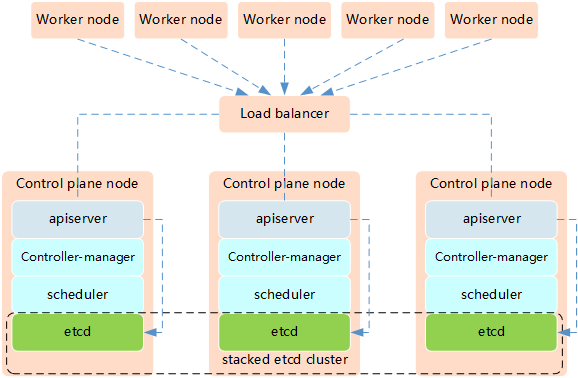
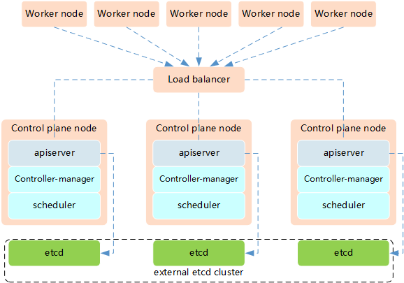

# Maintaining Kubernetes Clusters

## etcd install

* `etcd`需與`kubectl`、`kubeadm`、`kubelet`版本號一致
```sh
etcdctl version
```

## Backing up etcd

```sh
sudo ETCDCTL_API=3 etcdctl --endpoints=https://127.0.0.1:2379 \
  --cacert=/etc/kubernetes/pki/etcd/ca.crt \
  --cert=/etc/kubernetes/pki/etcd/server.crt \
  --key=/etc/kubernetes/pki/etcd/server.key \
  snapshot save /var/lib/dat-backup.db
```
- snapshot save <backup-file-location>，建議存於異地

#### Snapshot status
```sh
sudo etcdctl --write-out=table snapshot status /var/lib/dat-backup.db
```
- </var/lib/dat-backup.db>依照檔案路徑配置

## Restoring etcd with etctl
```sh
sudo ETCDCTL_API=3 etcdctl snapshot restore /var/lib/dat-backup.db --data-dir /var/lib/etcd
```

## Upgrading an existing Cluster (未驗證)
- 僅允許小版本分位更新
 ✅ 1.24.X &rarr; 1.25.X
 ❌ 1.24.X &rarr; 1.26.X
[changlog](https://github.com/kubernetes/kubernetes/tree/master/CHANGELOG)

### Upgrade Control Plane (master)
```sh
# update kubeadm
TARGET_VERSION = 1.3.2.X
sudo apt-get update
sudo apt-cache madison kubeadm
sudo apt-mark unhold kubeadm &&\
sudo apt-get update && sudo apt-get install -y kubeadm=$TARGET_VERSION &&\
sudo apt-mark hold kubeadm

# drain master node
kubectl drain k8s-master --ignore-daemonsets

sudo kubeadm upgrade plan
sudo kubeadm upgrade apply v$TARGET_VERSION

# uncordon
kubectl uncordon k8s-master

# update kubelet and kubectl
sudo apt-mark unhold kubelet kubectl && \
sudo apt-get update && sudo apt-get install -y kubelet=$TARGET_VERSION kubectl=$TARGET_VERSION && \
sudo apt-mark hold kubelet kubectl
# restart kubelet
sudo systemctl daemon-reload
sudo systemctl restart kubelet
```
### Upgrade work node (worker)
```sh
# go to master node
kubectl drain k8s-worker1 --ingore-daemonsets

# go to node and update kubeadm
TARGET_VERSION = 1.3.2.X
sudo apt-get update
sudo apt-cache madison kubeadm
sudo apt-mark unhold kubeadm &&\
sudo apt-get update && sudo apt-get install -y kubeadm=$TARGET_VERSION &&\
sudo apt-mark hold kubeadm

sudo kubeadm upgrade node

# update kubelet
sudo apt-mark unhold kubelet && \
sudo apt-get update && sudo apt-get install -y kubelet=$TARGET_VERSION && \
sudo apt-mark hold kubelet 
# restart kubelet
sudo systemctl daemon-reload
sudo systemctl restart kubelet

# go to master node, uncordon this node
kubectl uncordon k8s-worker1
```

## Highly Available Clusters

#### Option1

#### Option2

